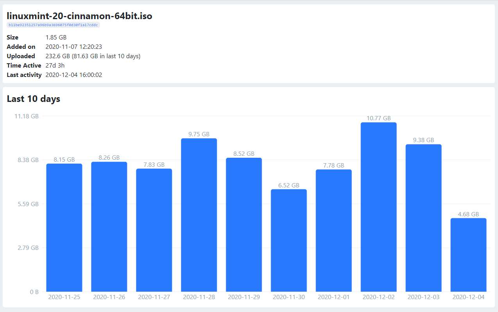

# qBittorrent WebUI Statistics
Utilities to collect and visualize statistical torrent activity data from [qBittorrent](https://github.com/qbittorrent/qBittorrent) WebUI API.

## Features
- Python script which collects torrent activity data into an SQLite database
- ExpressJS powered lightweight server which handles transactions between frontend, database and qBittorrent API
- Modern table with a clickable entry for each torrent in the database
- Beautiful bar chart showing daily upload amounts of last 10 days for every torrent
- Delete torrents from qBittorrent together with respective database entries straight from the frontend

## Usage
Coming soon...

## Todos
- [ ] Highlight the last selected torrent entry after returning from individual torrent view
- [ ] Show the total upload amount of last 10 days in the main torrents table
- [ ] Ability to change the maximum number of days displayed in the bar chart
- [ ] Chart ticks at round data values instead of automatically calculated ones

## Special thanks to creators of these awesome libraries
- [React tabulator](https://github.com/ngduc/react-tabulator)
- [Recharts](https://github.com/recharts/recharts)
