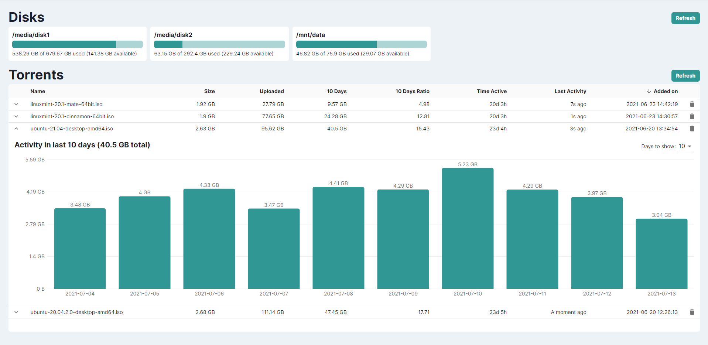

# qBittorrent WebUI Statistics
Utilities to collect and visualize statistical torrent activity data from [qBittorrent](https://github.com/qbittorrent/qBittorrent) WebUI API.



## Motivation
This project is meant help seeders who use [qbittorrent-nox](https://github.com/qbittorrent/qBittorrent) and seek an easier way of determining which torrents are the least active when it is time to free up disk space for newer torrents.

## Disclaimer
This is a quick project that I made for my own personal use, therefore it does not have user-friendly installation and usage procedures. The utilities underwent only minimal testing.

## Features
- Python script which collects torrent activity data into an SQLite database
- ExpressJS powered lightweight server which handles transactions between frontend, database and qBittorrent API
- Modern table with expandable rows revealing activity charts of up to 30 days for each torrent in the database
- Effortless deletion of any torrent and respective database entries in the UI

## Installation
Requires `NodeJS`
```
git clone https://github.com/tw34kus/qbittorrent-webui-stats.git
cd qbittorrent-webui-stats
npm install
npm run build
```
After installation, `config.json` in the [server](server) directory should be renamed to `config.local.json` and should include the correct path to the database file, relative to the project's root directory. In most cases, no modification of the file contents is needed.

## Usage
- The Python script at [utils/main.py](utils/main.py) fetches current data for all torrents by making a request to [qBittorrent WebUI API](https://github.com/qbittorrent/qBittorrent/wiki/WebUI-API-(qBittorrent-4.1)) which should be running at localhost:8888. It is recommended to set up your favorite task scheduling utility (e. g. `cron` on Linux) to run the script hourly. The script accepts an optional `--working-dir` argument which can be used to override the directory where the database file is stored (normally it is the current working directory, however, the override is useful when the script is run by operating system utilities, such as `cron`)
- The backend server is started by running `npm run server` from this project's root directory (requires elevated privileges if run on privileged port `0-1024`)
- The frontend can be accessed at `localhost` from a WEB browser on a PC in your local network.

## Todos
- [x] Show the total upload amount of last 10 days in the main torrents table
- [x] Ability to change the maximum number of days displayed in the bar chart
- [ ] Error handling both in server and the UI
- [ ] Chart ticks at round and predictable values
- [ ] Server port configuration option

## Special thanks to creators of these awesome libraries
- [Chakra UI](https://github.com/chakra-ui/chakra-ui)
- [Material UI](https://github.com/mui-org/material-ui)
- [Recharts](https://github.com/recharts/recharts)
